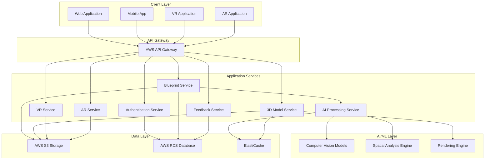

# Design Document: AI-Powered Architectural Visualization Platform

## Overview

The AI-Powered Architectural Visualization Platform is a cloud-native system that transforms 2D architectural blueprints into immersive 3D experiences. The platform leverages computer vision and machine learning to interpret architectural drawings, generate accurate 3D models, and provide VR/AR visualization capabilities.

The system follows a microservices architecture deployed on AWS, with distinct services for blueprint processing, AI interpretation, 3D model generation, and visualization rendering. This design ensures scalability, maintainability, and the ability to handle concurrent users while maintaining high performance.

## Architecture

The platform employs a distributed microservices architecture with the following key characteristics:

- **Event-driven communication** between services using AWS EventBridge
- **Containerized services** deployed on AWS ECS with auto-scaling
- **Serverless functions** for lightweight processing tasks using AWS Lambda
- **Multi-tier storage** with S3 for files, RDS for metadata, and ElastiCache for caching
- **API Gateway** for unified external interface and rate limiting



## Components and Interfaces

### Authentication Service
**Responsibility**: User authentication, authorization, and session management
**Technology**: Node.js with JWT tokens, AWS Cognito integration
**Interfaces**:
- `POST /auth/login` - User authentication
- `POST /auth/register` - User registration
- `GET /auth/verify` - Token validation
- `POST /auth/refresh` - Token refresh

### Blueprint Service
**Responsibility**: Blueprint upload, validation, storage, and metadata management
**Technology**: Python with FastAPI, AWS S3 integration
**Interfaces**:
- `POST /blueprints/upload` - Upload blueprint files
- `GET /blueprints/{id}` - Retrieve blueprint metadata
- `DELETE /blueprints/{id}` - Delete blueprint and associated data
- `GET /blueprints/user/{userId}` - List user's blueprints

### AI Processing Service
**Responsibility**: Computer vision analysis, spatial interpretation, and feature extraction
**Technology**: Python with TensorFlow/PyTorch, custom CNN models
**Interfaces**:
- `POST /ai/analyze` - Analyze blueprint and extract spatial data
- `GET /ai/status/{jobId}` - Check processing status
- `POST /ai/validate` - Validate extracted spatial data
- `GET /ai/features/{blueprintId}` - Retrieve extracted features

### 3D Model Service
**Responsibility**: 3D model generation, material application, and export
**Technology**: C++ with Blender Python API, Three.js for web rendering
**Interfaces**:
- `POST /models/generate` - Generate 3D model from spatial data
- `PUT /models/{id}/preferences` - Apply user preferences
- `GET /models/{id}/export` - Export model in specified format
- `POST /models/{id}/refine` - Refine model based on feedback

### VR Service
**Responsibility**: VR experience generation and optimization
**Technology**: Unity with WebXR, A-Frame for web VR
**Interfaces**:
- `POST /vr/generate` - Create VR walkthrough
- `GET /vr/{id}/experience` - Retrieve VR experience data
- `PUT /vr/{id}/settings` - Update VR experience settings
- `GET /vr/{id}/performance` - Get performance metrics

### AR Service
**Responsibility**: AR visualization and spatial alignment
**Technology**: ARCore/ARKit integration, WebXR for web AR
**Interfaces**:
- `POST /ar/align` - Align model with real-world coordinates
- `GET /ar/{id}/markers` - Retrieve AR tracking markers
- `PUT /ar/{id}/calibrate` - Calibrate AR positioning
- `GET /ar/{id}/overlay` - Get AR overlay data

### Feedback Service
**Responsibility**: Feedback collection, categorization, and workflow management
**Technology**: Node.js with Express, WebSocket for real-time updates
**Interfaces**:
- `POST /feedback/submit` - Submit user feedback
- `GET /feedback/project/{id}` - Retrieve project feedback
- `PUT /feedback/{id}/resolve` - Mark feedback as resolved
- `GET /feedback/analytics` - Get feedback analytics

## Data Models

### Blueprint Entity
```typescript
interface Blueprint {
  id: string;
  userId: string;
  filename: string;
  fileFormat: 'PDF' | 'DWG' | 'DXF';
  fileSize: number;
  uploadTimestamp: Date;
  processingStatus: 'PENDING' | 'PROCESSING' | 'COMPLETED' | 'FAILED';
  spatialData?: SpatialData;
  metadata: {
    dimensions: { width: number; height: number; };
    scale: number;
    units: 'FEET' | 'METERS' | 'INCHES';
  };
}
```

### SpatialData Entity
```typescript
interface SpatialData {
  id: string;
  blueprintId: string;
  rooms: Room[];
  walls: Wall[];
  doors: Door[];
  windows: Window[];
  extractionAccuracy: number;
  validationStatus: 'VALID' | 'NEEDS_REVIEW' | 'INVALID';
}

interface Room {
  id: string;
  name: string;
  type: 'BEDROOM' | 'BATHROOM' | 'KITCHEN' | 'LIVING_ROOM' | 'OTHER';
  boundaries: Point[];
  area: number;
  height: number;
}

interface Wall {
  id: string;
  startPoint: Point;
  endPoint: Point;
  thickness: number;
  height: number;
  material: string;
}

interface Point {
  x: number;
  y: number;
  z?: number;
}
```

### Model3D Entity
```typescript
interface Model3D {
  id: string;
  blueprintId: string;
  userId: string;
  generationStatus: 'GENERATING' | 'COMPLETED' | 'FAILED';
  preferences: UserPreferences;
  modelData: {
    vertices: number;
    faces: number;
    materials: string[];
    fileSize: number;
  };
  exportFormats: ('OBJ' | 'FBX' | 'GLTF' | 'IFC')[];
  createdAt: Date;
  updatedAt: Date;
}
```

### UserPreferences Entity
```typescript
interface UserPreferences {
  id: string;
  userId: string;
  projectId: string;
  materials: {
    walls: MaterialSpec;
    floors: MaterialSpec;
    ceilings: MaterialSpec;
  };
  lighting: {
    ambientIntensity: number;
    naturalLight: boolean;
    artificialLights: LightSpec[];
  };
  style: 'MODERN' | 'TRADITIONAL' | 'INDUSTRIAL' | 'MINIMALIST' | 'CUSTOM';
}

interface MaterialSpec {
  type: string;
  color: string;
  texture?: string;
  reflectivity: number;
}
```

### VRExperience Entity
```typescript
interface VRExperience {
  id: string;
  modelId: string;
  experienceData: {
    scenes: VRScene[];
    navigation: NavigationPoint[];
    interactions: InteractionSpec[];
  };
  performance: {
    targetFPS: number;
    renderQuality: 'LOW' | 'MEDIUM' | 'HIGH' | 'ULTRA';
    optimizations: string[];
  };
  platforms: ('OCULUS' | 'VIVE' | 'WEBXR')[];
}
```

### Feedback Entity
```typescript
interface Feedback {
  id: string;
  projectId: string;
  userId: string;
  type: 'DESIGN_CHANGE' | 'MATERIAL_PREFERENCE' | 'SPATIAL_CONCERN' | 'BUG_REPORT';
  priority: 'LOW' | 'MEDIUM' | 'HIGH' | 'CRITICAL';
  description: string;
  attachments: string[];
  location?: {
    modelId: string;
    coordinates: Point;
    roomId?: string;
  };
  status: 'OPEN' | 'IN_PROGRESS' | 'RESOLVED' | 'CLOSED';
  assignedTo?: string;
  createdAt: Date;
  resolvedAt?: Date;
}
```

Now I need to use the prework tool to analyze the acceptance criteria before writing the Correctness Properties section.
## Correctness Properties

*A property is a characteristic or behavior that should hold true across all valid executions of a system—essentially, a formal statement about what the system should do. Properties serve as the bridge between human-readable specifications and machine-verifiable correctness guarantees.*

### Property Reflection

After analyzing all acceptance criteria, I identified several areas where properties can be consolidated:
- File format validation and encryption properties can be combined into comprehensive data handling properties
- Performance properties (processing time, FPS, concurrent users) can be grouped by performance category
- Export format properties across different services can be unified
- Platform compatibility properties can be consolidated

### Core Properties

**Property 1: File Format Validation and Security**
*For any* uploaded file, the system should accept only valid architectural formats (PDF, DWG, DXF), encrypt the data using AES-256 at rest and TLS 1.3 in transit, and maintain version history
**Validates: Requirements 1.1, 1.3, 1.4, 1.5**

**Property 2: Processing Performance Consistency**
*For any* blueprint processing operation, the system should complete spatial data extraction within 30 seconds and 3D model generation within 5 minutes, regardless of concurrent load
**Validates: Requirements 1.2, 4.1, 8.2**

**Property 3: AI Accuracy and Error Handling**
*For any* blueprint with identifiable architectural elements, the Blueprint_Parser should achieve 95% accuracy in identifying walls, doors, windows, and room boundaries, and flag ambiguous areas when accuracy falls below threshold
**Validates: Requirements 3.1, 3.3**

**Property 4: Spatial Data Consistency**
*For any* processed blueprint, the extracted spatial data should have valid geometric relationships, standardized units, and be compatible with 3D modeling systems
**Validates: Requirements 3.2, 3.4, 3.5**

**Property 5: User Preference Application**
*For any* set of user preferences and 3D model, applying the preferences should result in a model that reflects the specified materials, lighting, and style choices
**Validates: Requirements 2.2, 2.3, 4.2**

**Property 6: Real-time Responsiveness**
*For any* user interaction with preferences or feedback, the system should provide immediate visual feedback and update the associated project data
**Validates: Requirements 2.4, 7.3**

**Property 7: VR Performance and Navigation**
*For any* 3D model with accessible rooms, the generated VR experience should maintain 90 FPS performance and allow navigation to all accessible spaces
**Validates: Requirements 5.1, 5.2, 5.3**

**Property 8: Platform Compatibility**
*For any* generated visualization content, it should be compatible with all specified platforms (VR headsets, mobile devices, AR glasses, WebXR)
**Validates: Requirements 5.5, 6.4**

**Property 9: AR Alignment and Stability**
*For any* AR visualization session, the system should maintain stable model positioning using GPS and device sensors, even when environmental conditions change
**Validates: Requirements 6.1, 6.2, 6.3**

**Property 10: Feedback Management Workflow**
*For any* submitted feedback, the system should categorize it correctly, notify relevant stakeholders, track resolution status, and maintain an audit trail
**Validates: Requirements 7.2, 7.3, 7.4**

**Property 11: Concurrent User Scalability**
*For any* system load up to 100 concurrent users, the platform should maintain performance without degradation and prioritize active user sessions over background processing
**Validates: Requirements 8.1, 8.4**

**Property 12: Auto-scaling Behavior**
*For any* change in system demand, cloud resources should automatically scale up or down to maintain performance while optimizing costs
**Validates: Requirements 8.3**

**Property 13: Authentication and Authorization**
*For any* system access attempt, multi-factor authentication should be required and role-based access control should enforce granular permissions
**Validates: Requirements 9.2, 9.3**

**Property 14: Secure Data Lifecycle**
*For any* data stored in the system, it should be encrypted with specified standards and provide secure deletion with verification when no longer needed
**Validates: Requirements 9.1, 9.4**

**Property 15: Export Format Universality**
*For any* 3D model or VR experience, the system should support export in all specified industry-standard formats (OBJ, FBX, glTF, IFC) and generate standalone applications for offline viewing
**Validates: Requirements 4.5, 10.1, 10.2**

**Property 16: Integration Data Consistency**
*For any* external system integration, data should remain consistent across all connected systems and APIs should function correctly with CAD and project management tools
**Validates: Requirements 10.3, 10.5**

**Property 17: Batch Processing Efficiency**
*For any* batch export request, the system should successfully export multiple visualizations while maintaining data integrity and performance
**Validates: Requirements 10.4**

**Property 18: Model Refinement Responsiveness**
*For any* user feedback applied to a 3D model, the system should update the model to reflect the requested changes and maintain structural accuracy
**Validates: Requirements 4.4**

**Property 19: Collaborative Session Support**
*For any* review session with multiple stakeholders, the system should support concurrent participation and real-time collaboration features
**Validates: Requirements 7.5**

**Property 20: Construction Progress Comparison**
*For any* AR session on a construction site, the system should enable real-time comparison between planned design and actual construction progress
**Validates: Requirements 6.5**

## Error Handling

### Blueprint Processing Errors
- **Invalid File Format**: Return HTTP 400 with specific format requirements
- **File Size Exceeded**: Return HTTP 413 with maximum size limits
- **Parsing Failure**: Flag for manual review and notify user with estimated resolution time
- **Spatial Data Corruption**: Retry processing with alternative algorithms, escalate if persistent

### AI Processing Errors
- **Low Confidence Detection**: Flag ambiguous areas and request manual verification
- **Impossible Geometry**: Return detailed validation errors with suggested corrections
- **Processing Timeout**: Implement graceful degradation with partial results
- **Model Training Drift**: Monitor accuracy metrics and trigger model retraining

### 3D Model Generation Errors
- **Memory Exhaustion**: Implement model complexity reduction and retry
- **Rendering Failures**: Fallback to lower quality settings and notify user
- **Preference Application Errors**: Validate preferences before application, provide defaults
- **Export Format Errors**: Retry with alternative export libraries, log detailed errors

### VR/AR Errors
- **Performance Degradation**: Automatically reduce quality settings to maintain FPS
- **Platform Compatibility Issues**: Provide platform-specific error messages and alternatives
- **Tracking Failures**: Implement re-calibration workflows and user guidance
- **Network Connectivity**: Enable offline mode with cached content

### System-Level Errors
- **Database Connection Failures**: Implement connection pooling and automatic retry logic
- **Service Unavailability**: Use circuit breaker pattern and graceful degradation
- **Authentication Failures**: Provide clear error messages and account recovery options
- **Rate Limiting**: Return HTTP 429 with retry-after headers

## Testing Strategy

### Dual Testing Approach

The testing strategy employs both unit testing and property-based testing to ensure comprehensive coverage:

**Unit Tests**: Focus on specific examples, edge cases, and integration points between components. Unit tests validate concrete scenarios and error conditions that are difficult to generate randomly.

**Property Tests**: Verify universal properties across all possible inputs using randomized test data. Property tests ensure that the system behaves correctly for the vast space of possible inputs that unit tests cannot cover.

Together, these approaches provide comprehensive coverage where unit tests catch specific bugs and property tests verify general correctness across the input space.

### Property-Based Testing Configuration

**Testing Framework**: Use Hypothesis for Python services, fast-check for Node.js services, and QuickCheck-style libraries for other languages.

**Test Configuration**:
- Minimum 100 iterations per property test (due to randomization)
- Each property test must reference its design document property
- Tag format: **Feature: ai-architectural-visualization, Property {number}: {property_text}**
- Timeout limits: 30 seconds per property test, 5 minutes for integration properties

**Test Data Generation**:
- Blueprint generators: Create valid and invalid architectural drawings
- Spatial data generators: Generate geometric data with various complexity levels
- User preference generators: Create realistic preference combinations
- Performance load generators: Simulate concurrent user scenarios

### Unit Testing Focus Areas

**Blueprint Service**:
- File format validation edge cases
- Large file handling
- Concurrent upload scenarios
- Storage encryption verification

**AI Processing Service**:
- Known blueprint test cases with expected outputs
- Edge cases: empty files, corrupted data, unusual scales
- Performance benchmarks with standard test blueprints
- Accuracy validation with manually verified datasets

**3D Model Service**:
- Preference application with extreme values
- Export format compatibility verification
- Memory usage optimization tests
- Model refinement workflow validation

**VR/AR Services**:
- Platform-specific compatibility tests
- Performance benchmarking on target hardware
- Tracking accuracy with known environments
- User interaction workflow validation

**Integration Testing**:
- End-to-end workflow from blueprint upload to visualization
- Cross-service communication and error propagation
- Authentication and authorization across service boundaries
- Data consistency during concurrent operations

### Performance Testing

**Load Testing**:
- 100 concurrent users performing typical workflows
- Blueprint processing under various load conditions
- Database performance under concurrent access
- Auto-scaling behavior validation

**Stress Testing**:
- Maximum file size handling
- Complex blueprint processing limits
- Memory usage under extreme conditions
- Recovery behavior after resource exhaustion

### Security Testing

**Authentication Testing**:
- Multi-factor authentication workflows
- Session management and timeout handling
- Role-based access control validation
- Token security and refresh mechanisms

**Data Security Testing**:
- Encryption verification at rest and in transit
- Secure deletion validation
- Access logging and audit trail verification
- GDPR compliance validation workflows